# python-on-gsheets-and-strava-api

Automates fetching activity data from Strava, updating a Google Sheet with new activity tables, and generating charts (e.g., "Weight over Time") using Python—completely hands-free.

It follows this process:


---

## Main actions of the app

The main script automates figures and graphs on Google Sheets:

1. Authenticates and connects to a specified Google Sheet using credentials.
2. Builds a lookup dictionary for activity names from the main sheet.
3. Ensures the data format of the main sheet is correct.
4. Ensures a 'graphs' sheet exists in the spreadsheet, creating it if necessary.
5. Creates a "Weight over Time" line chart on the 'graphs' sheet using columns A (date) and D (weight).
6. Fetches recent activities from the Strava API (default limit: 5).
7. Matches fetched activities with those already present in the sheet to avoid duplicates.
8. For today's activities not already present, inserts activity tables into the 'graphs' sheet, spacing them horizontally across columns.Each activity table for today is placed next to the previous one in separate columns to avoid overlap.
9. Logs all major actions and exceptions with UTC timestamps.
10. Handles and logs any exceptions that occur during execution.

---

## Environment Variables

| Variable              | Description |
|-----------------------|-------------|
| `GOOGLE_SHEET_FILE`   | The filename or ID of the Google Sheet to use. |
| `GRAPHS_SHEET_NAME`   | The sheet/tab where graphs and activity tables will be managed. |
| `CRON_SCHEDULE`       | Cron format schedule for automated runs inside the container (e.g., "0 6 * * *"). |

---

## Mounts

| Host Path                   | Container Path                             | Mode  |
|------------------------------|--------------------------------------------|-------|
| ./credentials/google_creds.json | /app/src/credentials/google_creds.json     | ro    |
| ./credentials/strava_creds.ini  | /app/src/credentials/strava_creds.ini      | rw    |

> **Note:** The Strava credentials file requires read & write because the app auto-refreshes tokens.

---

## Dependencies

- **credentials/google_creds.json** mounted on the container. From Google Cloud Console, with Google Sheets API and Google Drive API enabled.
- **credentials/strava_creds.ini** mounted on the container. From the Strava API app.
- The Google Sheet file must be shared with the **Google service account** with **editor permissions**.
- **requirements.txt**
    ```txt
    gspread>=5.8.0
    google-api-python-client>=2.99.0
    google-auth>=2.22.0
    google-auth-httplib2>=0.1.0
    gspread-formatting>=1.1.7
    requests>=2.31.0
    ```

### Custom modules
- **google_sheets**: Custom module for Google Sheets authentication and manipulation.
- **strava**: Custom module for fetching and matching Strava activities.
- **charts_helpers**: Custom module for chart creation.

### Logging
The app logs all major actions and any exceptions to stdout with UTC timestamps.
To view logs in real-time for the running container:
```bash
docker compose logs -f python-on-gsheets
```

### Deployment
1. **Clone the repository**  
   ```bash
   git clone https://github.com/dibaltzis/python-on-gsheets-and-strava-api.git
   cd automate-figures-and-graphs-on-google-sheets-with-python
   ```
2. **Add your credentials**  
   Place your `google_creds.json` and `strava_creds.ini` files in the `credentials/` directory.

3. **Configure environment variables**  
   Edit `docker-compose.yml` to set the Google Sheet file name, sheet name, and cron schedule.

4. **Build the service**  
   ```bash
   docker compose -f docker-compose.yml build --no-cache python-on-gsheets
   ```
5. **(Optional) For development mode**  
   Use the `python-on-gsheets-dev` service for development and debugging.  
   ```bash
   docker compose -f docker-compose.yml --profile dev build --no-cache python-on-gsheets-dev
   ```

6.  **Run the service**
    ```bash
    docker compose -f docker-compose.yml up -d python-on-gsheets
    ```
